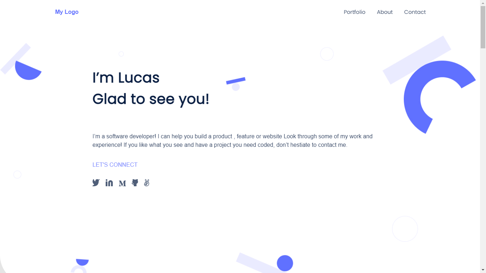

# mobile-version-portfolio-skeleton

> A skeleton of a mobile version of a portfolio

## Built With

- HTML
- CSS

## Getting Started

**This is an example of how you may give instructions on setting up your project locally.**

To get a local copy up and running follow these simple example steps.

### Download 
https://github.com/Lucas-Masaba/mobile-version-portfolio-skeleton.git
 
or
 
git clone git@github.com:Lucas-Masaba/mobile-version-portfolio-skeleton

## Authors

👤 **Khusiima Luke Masaba**

- GitHub: [@githubhandle](https://github.com/Lucas-Masaba)
- Twitter: [@twitterhandle](https://twitter.com/MasabaLuke)
- LinkedIn: [LinkedIn](https://linkedin.com/in/khusiima-luke-masaba-59060a121)

## Show your support

Give a ⭐️ if you like this project!

